<p align="center">
  
</p>

<p align="center">
  
</p>

<p align="center">
  <a href="https://github.com/HUNT-001">
    
  </a>
  &nbsp;
  <a href="https://www.linkedin.com/in/vakkalagadda-tanush-pavan-a37a20308/">
    
  </a>
  &nbsp;
  <a href="https://vtanushpavan.vercel.app/">
    
  </a>
  &nbsp;
  <a href="mailto:tanushpavanv@gmail.com">
    
  </a>
</p>

<p align="center">
  <b>I build intelligent systems at both ends of the stack — the algorithm that decides, and the silicon it decides on.</b>
</p>

<p align="center">
  
  
  
  
</p>

<p align="center">
  
</p>


<!-- ═══════════════════════════════ ABOUT ═══════════════════════════════ -->


<p align="center">
I'm a dual-degree student working on <b>efficient intelligent systems</b> — the kind that have to survive<br>
both a loss curve and a timing report.
</p>

<p align="center">
Most people pick a side: the model or the machine. I find the interesting problems live in the seam between them.<br>
A world model is only useful if something can run it. A datapath is only worth building if something worth running exists.
</p>

<p align="center">
🧠 <b>Above the line</b> — world models, model-based RL, graph neural networks, agentic systems, quantum-inspired ML<br>
⚙️ <b>Below the line</b> — RTL design, functional verification, AI accelerators, quantized inference, edge deployment<br>
🔬 <b>Across it</b> — hardware-aware ML, HW/SW co-design, and my own algorithmic research
</p>

<details>
<summary><b>&nbsp;Profile summary — click to expand</b></summary>

<br>

```python
class Engineer:
    """The seam between what thinks and what it thinks on."""

    identity = {
        "name":    "Tanush Pavan",
        "degrees": ["BS Data Science — IIT Madras",
                    "B.Tech Electrical & Electronics — Amrita Vishwa Vidyapeetham"],
        "thesis":  "intelligence is an architecture problem before it is a scale problem",
    }

    experience = [
        ("Wipro",         "AI Engineer Intern",  "applied ML, RL for sequential decisions"),
        ("ADRIN — ISRO",  "Edge AI Intern",      "HLS datapath for MobileViTv2 on Versal VCK-190"),
    ]

    research = {
        "world_models":   ["RSSM", "latent imagination", "learned dynamics"],
        "rl":             ["model-based", "actor-critic", "λ-returns", "exploration"],
        "graphs":         ["message passing", "GNNs over netlists and circuits"],
        "agentic":        ["planner/critic loops", "tool use", "cost-aware search"],
        "quantum":        ["variational circuits", "parameter-shift", "QML"],
        "verification":   ["UVM", "cocotb", "SVA", "formal model checking"],
        "silicon":        ["RTL", "microarchitecture", "accelerators", "HLS"],
    }

    def philosophy(self):
        return ("Efficiency is not an optimization pass you run at the end. "
                "It is a decision you make in the first hour, and defend in every one after.")
```

</details>

<p align="center">
  
</p>

<p align="center">
  
</p>


<!-- ═══════════════════════════════ RESEARCH ═══════════════════════════════ -->


<p align="center">
  
</p>

<p align="center">
<i>Six threads, one question: how do you build something that models its world well enough to act in it — cheaply enough to matter?</i>
</p>


<!-- ═══════════════════════════════ MATHEMATICS ═══════════════════════════════ -->


<p align="center">
  
</p>

<p align="center">
<i>The formalism I actually work in. Not decoration — these are the objects I'm debugging when something doesn't converge.</i>
</p>

<details open>
<summary><b>&nbsp;🌍 &nbsp;World Models — learning a latent you can plan inside</b></summary>

<br>

A world model compresses observations into a latent state whose *dynamics* are learnable. The recurrent state-space model splits that state in two: a deterministic path $`h_t`$ that carries memory, and a stochastic path $`z_t`$ that carries uncertainty.

<p align="center">
  <picture>
    <source media="(prefers-color-scheme: dark)" srcset="assets/eq/eq-01-dark.svg">
    
  </picture>
</p>

Training maximises the evidence lower bound — reconstruct the observation, predict the reward, and pay a KL price for every bit of surprise smuggled into the latent:

<p align="center">
  <picture>
    <source media="(prefers-color-scheme: dark)" srcset="assets/eq/eq-02-dark.svg">
    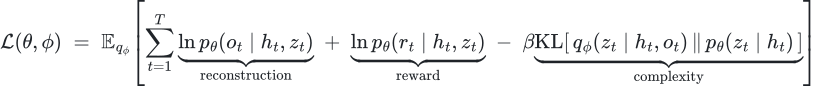
  </picture>
</p>

Once the dynamics are learned, you never have to touch the environment again to improve the policy. You roll out *inside the model* and train on imagined trajectories, bootstrapped with a $`\lambda`$-return:

<p align="center">
  <picture>
    <source media="(prefers-color-scheme: dark)" srcset="assets/eq/eq-03-dark.svg">
    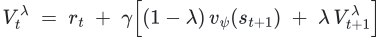
  </picture>
</p>

**The part that's genuinely hard:** $`\beta`$ is the whole argument. Too low and the model memorises pixels instead of learning consequence. Too high and the posterior collapses onto the prior — the model stops dreaming, and every rollout returns the same beige future.

</details>

<details>
<summary><b>&nbsp;🎯 &nbsp;Reinforcement Learning — the objects underneath</b></summary>

<br>

An MDP is the tuple $`\langle \mathcal{S}, \mathcal{A}, P, R, \gamma \rangle`$, and everything else follows from wanting to maximise discounted return $`G_t = \sum_{k\ge 0} \gamma^k r_{t+k}`$.

**Bellman optimality** — the fixed point every value-based method is chasing:

<p align="center">
  <picture>
    <source media="(prefers-color-scheme: dark)" srcset="assets/eq/eq-04-dark.svg">
    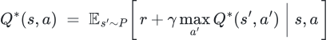
  </picture>
</p>

**Policy gradient** — when the action space stops being something you can argmax over:

<p align="center">
  <picture>
    <source media="(prefers-color-scheme: dark)" srcset="assets/eq/eq-05-dark.svg">
    
  </picture>
</p>

**GAE** — the bias/variance dial on the advantage estimate:

<p align="center">
  <picture>
    <source media="(prefers-color-scheme: dark)" srcset="assets/eq/eq-06-dark.svg">
    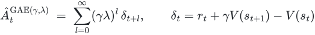
  </picture>
</p>

**Why model-based:** model-free RL pays for every gradient step in real environment interactions. A world model converts sample complexity into compute complexity — and compute is the thing I know how to make cheaper in hardware.

</details>

<details>
<summary><b>&nbsp;🕸️ &nbsp;Graph Neural Networks — because a netlist is a graph</b></summary>

<br>

Message passing in its general form — aggregate from the neighbourhood, update, repeat:

<p align="center">
  <picture>
    <source media="(prefers-color-scheme: dark)" srcset="assets/eq/eq-07-dark.svg">
    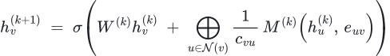
  </picture>
</p>

where $`\bigoplus`$ is any permutation-invariant aggregator. The spectral view, symmetrically normalised:

<p align="center">
  <picture>
    <source media="(prefers-color-scheme: dark)" srcset="assets/eq/eq-08-dark.svg">
    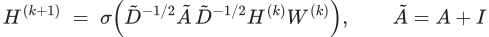
  </picture>
</p>

Attention as a learned aggregator, which is where GNNs and transformers turn out to be the same idea wearing different clothes:

<p align="center">
  <picture>
    <source media="(prefers-color-scheme: dark)" srcset="assets/eq/eq-09-dark.svg">
    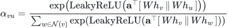
  </picture>
</p>

**Why I care:** a gate-level netlist, a placement, a routing congestion map and a dataflow graph are all graphs. Every EDA problem that currently costs hours of heuristic search is a graph learning problem that nobody has finished attacking.

</details>

<details>
<summary><b>&nbsp;🤖 &nbsp;Agentic AI — planning with a budget</b></summary>

<br>

An agent that can call tools is doing sequential decision-making where actions have *cost*, not just consequence. The honest objective includes the bill:

<p align="center">
  <picture>
    <source media="(prefers-color-scheme: dark)" srcset="assets/eq/eq-10-dark.svg">
    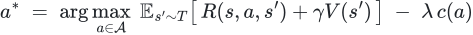
  </picture>
</p>

where $`c(a)`$ is latency, tokens, API spend, or blast radius. Drop that term and you get an agent that solves the task by brute-force calling everything it can reach.

**Search over reasoning** — tree search with a learned value, borrowed wholesale from planning:

<p align="center">
  <picture>
    <source media="(prefers-color-scheme: dark)" srcset="assets/eq/eq-11-dark.svg">
    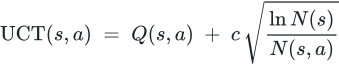
  </picture>
</p>

**Where I've shipped this:** an agentic AI system for fintech, built at Mumbai Hacks 2024 — finished **runner-up**. Constrained action space, real cost model, hard correctness requirements. Financial agents are a good forcing function: they make you take $`c(a)`$ seriously.

</details>

<details>
<summary><b>&nbsp;⚡ &nbsp;Quantized &amp; Binary Networks — the math that makes edge inference possible</b></summary>

<br>

Uniform affine quantization — scale $`s`$, zero-point $`z`$, round-to-nearest:

<p align="center">
  <picture>
    <source media="(prefers-color-scheme: dark)" srcset="assets/eq/eq-12-dark.svg">
    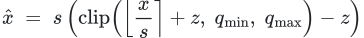
  </picture>
</p>

Rounding has zero gradient almost everywhere, so training uses the straight-through estimator — pretend the quantizer is the identity inside the clipping range:

<p align="center">
  <picture>
    <source media="(prefers-color-scheme: dark)" srcset="assets/eq/eq-13-dark.svg">
    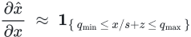
  </picture>
</p>

At the binary extreme, weights collapse to a sign and a single scale per filter:

<p align="center">
  <picture>
    <source media="(prefers-color-scheme: dark)" srcset="assets/eq/eq-14-dark.svg">
    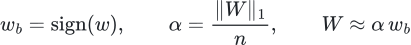
  </picture>
</p>

which turns a multiply-accumulate into `XNOR` + `popcount` — and *that* is a sentence about hardware, not about machine learning.

**The constraint that decides everything** — arithmetic intensity against the roofline:

<p align="center">
  <picture>
    <source media="(prefers-color-scheme: dark)" srcset="assets/eq/eq-15-dark.svg">
    
  </picture>
</p>

Most "slow" models are not compute-bound. They are memory-bound, and quantization is a bandwidth optimization that happens to look like a numerics one.

</details>


<!-- ═══════════════════════════════ QUANTUM ═══════════════════════════════ -->


<p align="center">
  
</p>

<details>
<summary><b>&nbsp;⚛️ &nbsp;The quantum thread — what I'm actually studying</b></summary>

<br>

A state on $`n`$ qubits lives in $`\mathbb{C}^{2^n}`$, which is the entire promise and the entire problem. Variational algorithms hedge: put a shallow parameterised circuit on the quantum device, keep the optimiser classical.

<p align="center">
  <picture>
    <source media="(prefers-color-scheme: dark)" srcset="assets/eq/eq-16-dark.svg">
    
  </picture>
</p>

The Hamiltonian decomposes into Pauli strings you can actually measure:

<p align="center">
  <picture>
    <source media="(prefers-color-scheme: dark)" srcset="assets/eq/eq-17-dark.svg">
    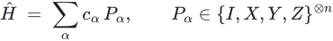
  </picture>
</p>

Gradients come from the **parameter-shift rule** — exact, not finite-difference, which is the detail that makes the whole thing trainable:

<p align="center">
  <picture>
    <source media="(prefers-color-scheme: dark)" srcset="assets/eq/eq-18-dark.svg">
    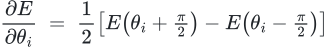
  </picture>
</p>

**The honest caveat:** barren plateaus. For a random deep ansatz on $`n`$ qubits, gradient variance decays as $`\mathcal{O}(2^{-n})`$ — the landscape flattens exponentially and the optimiser has nothing to descend. Structured ansätze and local cost functions are the live area, and I'm reading rather than claiming here.

**Why it sits next to the silicon work:** both are about extracting useful computation from a physical substrate that does not care about your abstractions. Coherence times and setup time are the same genre of constraint.

</details>


<!-- ═══════════════════════════════ SILICON ═══════════════════════════════ -->


<p align="center">
  
</p>

<details open>
<summary><b>&nbsp;⏱️ &nbsp;Timing, power, area — the three numbers you are always trading</b></summary>

<br>

**Setup closure** — the clock period has to cover the whole combinational path:

<p align="center">
  <picture>
    <source media="(prefers-color-scheme: dark)" srcset="assets/eq/eq-19-dark.svg">
    
  </picture>
</p>

**Hold closure** — the failure mode that survives simulation and kills silicon, because it is frequency-independent:

<p align="center">
  <picture>
    <source media="(prefers-color-scheme: dark)" srcset="assets/eq/eq-20-dark.svg">
    
  </picture>
</p>

You cannot slow the clock to fix a hold violation. That asymmetry is why hold buffers exist and why CTS matters more than it looks.

**Dynamic and static power:**

<p align="center">
  <picture>
    <source media="(prefers-color-scheme: dark)" srcset="assets/eq/eq-21-dark.svg">
    
  </picture>
</p>

The quadratic on $`V_{DD}`$ is the single most exploitable fact in low-power design — and the reason DVFS beats almost any microarchitectural trick you can name.

**Amdahl, for accelerator scoping** — the sentence that kills bad accelerator proposals early:

<p align="center">
  <picture>
    <source media="(prefers-color-scheme: dark)" srcset="assets/eq/eq-22-dark.svg">
    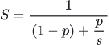
  </picture>
</p>

If your kernel is 60% of runtime, an *infinitely* fast accelerator buys you 2.5×. Profile before you build.

</details>

<details>
<summary><b>&nbsp;🔧 &nbsp;What I actually do at each stage</b></summary>

<br>

| Stage | What I do | Tooling |
|:--|:--|:--|
| **Spec / architecture** | throughput, latency and area budgets before a line of RTL; roofline analysis on the target kernel | Python, spreadsheets, arguing |
| **RTL** | synthesisable SystemVerilog, clean handshakes, parameterised datapaths | SystemVerilog, Verilog |
| **Lint / CDC** | rule cleanliness and clock-domain safety before simulation gets expensive | lint flows, CDC review |
| **Verification** | UVM environments, cocotb testbenches, SVA properties, coverage closure | UVM, cocotb, SVA |
| **Synthesis** | constraint writing, timing exploration, understanding what the tool did to my intent | Vivado, standard flows |
| **FPGA / HLS** | HLS datapath design and hardware-aware model restructuring | Vivado HLS, Versal ACAP |
| **Signoff literacy** | reading STA reports, understanding DRC/LVS as a design constraint rather than someone else's problem | reports, and patience |

**Concretely:** at ADRIN (ISRO) I designed a custom HLS-based datapath to deploy **MobileViTv2** — a vision transformer — on the **AMD Versal ACAP VCK-190**. Transformers on edge silicon are an exercise in memory hierarchy, not in FLOPs. The attention block is the bandwidth problem; everything else is arithmetic you can schedule.

</details>


<!-- ═══════════════════════════════ VERIFICATION ═══════════════════════════════ -->


<p align="center">
  
</p>

<details>
<summary><b>&nbsp;🔍 &nbsp;Why constrained-random needs so many runs — and when to stop</b></summary>

<br>

Random stimulus hitting $`n`$ distinct coverage bins is the coupon-collector problem. The expected number of runs to hit all of them:

<p align="center">
  <picture>
    <source media="(prefers-color-scheme: dark)" srcset="assets/eq/eq-23-dark.svg">
    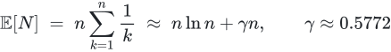
  </picture>
</p>

For $`n = 1000`$ bins that is roughly **7,500 runs** — and the tail is worse than the mean suggests. This is the quantitative argument for *directed* tests on the hard corners: you do not random-walk into a 1-in-$`10^6`$ state, you go there deliberately.

The complementary argument, for formal: model checking does not sample the state space, it quantifies over it. Where a property is small and the state space is bounded, a proof beats $`7{,}500`$ simulations and finishes sooner.

**My working rule:** lint and CDC first because they're free. cocotb for iteration speed while the design is still moving. UVM once the interfaces stabilise and you need real reuse. SVA everywhere, because an assertion that fires next to the bug is worth a hundred waveforms. Formal on the control logic where the state space is small enough to be exhausted.

</details>

<details>
<summary><b>&nbsp;🐍 &nbsp;cocotb — and the open-source tooling around it</b></summary>

<br>

Python testbenches are not a toy. They give you the whole scientific stack next to your DUT: numpy for reference models, pytest for structure, CI that actually runs on every push. The tradeoff is simulation speed at the boundary — which matters less than people assume for anything below full-chip.

I maintain **[`cocotb-v2-migration-helper`](https://github.com/HUNT-001/cocotb-v2-migration-helper)** for exactly this reason: the v1 → v2 API break is mechanical enough to automate and tedious enough that people put it off, and testbench debt compounds faster than design debt.

</details>


<!-- ═══════════════════════════════ FABRICATION ═══════════════════════════════ -->


<p align="center">
  
</p>

<details>
<summary><b>&nbsp;🔬 &nbsp;Process physics — the constraints that reach all the way up to RTL</b></summary>

<br>

**Lithography sets the floor.** Rayleigh, for resolution and depth of focus:

<p align="center">
  <picture>
    <source media="(prefers-color-scheme: dark)" srcset="assets/eq/eq-24-dark.svg">
    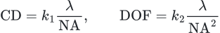
  </picture>
</p>

EUV at $`\lambda = 13.5\,\text{nm}`$ with $`\mathrm{NA} = 0.33`$ gets you to roughly 13 nm half-pitch in a single exposure. Below that you either multi-pattern (LELE, SADP, SAQP — each adding cost, mask count and overlay error) or you move to High-NA at $`0.55`$ and accept a smaller field. Note the square in the DOF term: every gain in resolution costs you focus budget quadratically. There is no free tightening.

**Yield decides whether any of it matters.** Murphy's model, for a die of area $`A`$ and defect density $`D_0`$:

<p align="center">
  <picture>
    <source media="(prefers-color-scheme: dark)" srcset="assets/eq/eq-25-dark.svg">
    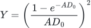
  </picture>
</p>

Yield falls off *superlinearly* with die area. That single fact is why chiplets exist, why big dies are disproportionately expensive, and why "just make the accelerator bigger" is an economic proposal before it is an architectural one.

**Devices, as they've actually moved:** planar → FinFET → gate-all-around nanosheet, each transition driven by electrostatic control of a shrinking channel. Short-channel effects are what happens when the gate stops winning against the drain, and the whole device roadmap is a sequence of geometric answers to that one problem.

**Why an RTL person should know this:** wire delay does not scale like gate delay. Beyond a certain node, interconnect dominates — which means floorplan is a microarchitectural decision, not a backend one, and locality in your dataflow is worth more than gate count.

</details>


<!-- ═══════════════════════════════ ALGORITHMS ═══════════════════════════════ -->


<p align="center">
<i>Original work in progress. Written down here because a claim you've committed to a public repo<br>is a claim you have to keep honest.</i>
</p>

<!--
  ▸ TANUSH — fill these in as threads mature. Keep the format:
    thread name | one-line hypothesis | current status | what would falsify it
    Delete rows that go nowhere. A research log is more credible with dead ends in it.
-->

| Thread | Hypothesis | Status |
|:--|:--|:--|
| **Hardware-aware latent dynamics** | world-model latents shaped by a hardware cost term learn representations that are cheaper to *run*, not just cheaper to store | active |
| **GNNs over netlists** | structural graph learning can replace heuristic passes in verification triage and design-space search | active |
| **Cost-aware agentic planning** | making $`c(a)`$ a first-class term in the agent objective changes behaviour qualitatively, not just quantitatively | active, from Mumbai Hacks work |
| **Binary/quantized accelerator co-design** | quantization schemes chosen *jointly* with the datapath beat schemes chosen for the model alone | active, tied to ADRIN work |
| **Verification-informed architecture** | designs that are cheap to verify are a distinguishable class, and the property is predictable from the RTL | early |

<details>
<summary><b>&nbsp;📐 &nbsp;How I run a research thread</b></summary>

<br>

1. **Write the objective down in full.** If I can't put the loss on one line, I don't understand the problem yet.
2. **Find the constraint that actually binds.** Usually memory bandwidth, sample complexity, or verification effort — rarely the thing the paper emphasises.
3. **Build the smallest thing that could fail.** A baseline that can be beaten, or a claim that can be falsified.
4. **Measure against a roofline, not a vibe.** "Faster" is meaningless without knowing what the ceiling was.
5. **Write down what didn't work.** The dead ends are the part that's actually mine.

</details>


<!-- ═══════════════════════════════ ACHIEVEMENTS ═══════════════════════════════ -->


<p align="center">
  
</p>

| Competition | Result | Domain |
|:--|:--|:--|
| **Smart India Hackathon 2025** | 🏅 Grand Finale — national finalist | Govt. of India, national-scale problem statement |
| **Mumbai Hacks 2024** | 🥈 **Runner-Up** | Agentic AI for FinTech |
| **Analog Design Quest** | 🏅 Finalist | Analog / mixed-signal circuit design |
| **Mirabilis Design Hacks** | 🏅 Finalist | System-level modelling &amp; architecture |

<p align="center">
<i>Four national-level finals across three unrelated domains — agentic AI, analog design, and system architecture.<br>
The through-line isn't the subject. It's being able to go from a cold problem statement to a defensible build in 36 hours.</i>
</p>


<!-- ═══════════════════════════════ EXPERIENCE ═══════════════════════════════ -->


<table align="center">
<tr>
<td width="50%" valign="top">

### WIPRO
**`AI Engineer Intern · 2 months`**

```yaml
Role: Applied AI / ML engineering
Work:
  - Built and evaluated ML models for real
    deployment scenarios, not notebooks
  - Explored RL approaches for sequential
    decision-making problems
  - Assessed robustness and production
    readiness across experiments
Takeaway: >
  The gap between a model that scores well
  and a model you can deploy is mostly
  everything that isn't the model.
```

</td>
<td width="50%" valign="top">

### ADRIN — NRSC, ISRO
**`Edge AI Intern · 45 days`**

```yaml
Role: Edge AI / HW-SW co-design
Work:
  - Custom HLS datapath to deploy MobileViTv2
    on AMD Versal ACAP (VCK-190)
  - Hardware-aware optimisation of a vision
    transformer for edge inference
  - Applied ML for remote sensing pipelines
Takeaway: >
  A transformer on edge silicon is a memory
  hierarchy problem wearing an attention mask.
```

</td>
</tr>
</table>


<!-- ═══════════════════════════════ PROJECTS ═══════════════════════════════ -->


<p align="center">
  <a href="https://github.com/HUNT-001/cocotb-v2-migration-helper">
    
  </a>
  <a href="https://github.com/HUNT-001/ai-chip-design-platform">
    
  </a>
</p>
<p align="center">
  <a href="https://github.com/HUNT-001/solar-digital-twin">
    
  </a>
  <a href="https://github.com/HUNT-001/Electro-thermal-modelling">
    
  </a>
</p>


<!-- ═══════════════════════════════ INTERFACE / DESIGN ═══════════════════════════════ -->


<p align="center">
<i>Everything above this line is hand-authored SVG. No template, no generator, no screenshot.<br>
The page is the portfolio piece — so here is the design system it runs on.</i>
</p>

<details>
<summary><b>&nbsp;🎨 &nbsp;The design system behind this README</b></summary>

<br>

**Colour tokens** — a single ramp from substrate to signal, with a violet axis reserved for anything quantum or probabilistic:

| Token | Hex | Role |
|:--|:--|:--|
| `substrate` | `#030811` | deepest background, page floor |
| `die` | `#071226` | mid background |
| `well` | `#0C1D3E` | panel fill, raised surface |
| `trace` | `#1B3566` | borders, hairlines |
| `signal` | `#38BDF8` | primary accent, silicon domain |
| `signal-alt` | `#22D3EE` | secondary accent, motion |
| `ink` | `#C8E0F8` | primary text |
| `ink-dim` | `#7FA6D4` | annotation, metadata |
| `quantum` | `#A78BFA` | probabilistic / quantum domain |
| `quantum-alt` | `#C084FC` | quantum secondary |

**Type scale** — three families, three jobs. Segoe UI for headings (authority), JetBrains Mono / Consolas for anything machine-adjacent (labels, code, annotation), and a math serif for equations. Section headers run at 30px / 700 / +10 letter-spacing; annotations at 9–11px mono with lowered opacity so they read as marginalia rather than content.

**Motion, deliberately restrained** — every animation is a 3–9 second loop with no easing spikes, so nothing competes for attention. Travelling pulses along circuit rails, a slow scan sweep across banners, coverage bars that fill once and freeze, a Bloch vector that precesses. Motion signals *aliveness*, not urgency.

**Layout rules** — a fixed 1400px design width with 16–18px corner radii, consistent 60px side gutters, and a dot-grid at 10% opacity across every panel so the whole page reads as one continuous surface rather than a stack of unrelated images.

**Accessibility notes** — every graphic carries `alt` text; nothing critical is conveyed by colour alone; contrast ratios on body text clear 7:1 against the substrate; the page degrades to readable structured markdown if images fail to load.

</details>

<details>
<summary><b>&nbsp;🖥️ &nbsp;How this profile is built</b></summary>

<br>

- **Hand-authored SVG** for every banner, divider, diagram and equation plate — generated from parameterised Python so the geometry is computed, not eyeballed
- **LaTeX typeset to SVG** via MathJax at build time, with light and dark variants served through `<picture>` — GitHub mangles double-dollar math inside collapsible blocks (it strips backslashes and eats underscore pairs as italics), so the equations are pre-rendered instead. The TeX source lives in `tools/equations.json` and in every image's `alt` text
- **GitHub Actions** regenerate the 3D contribution graph and the contribution snake on a schedule
- **Progressive disclosure** via `<details>` — the page skims in thirty seconds and reads for thirty minutes, depending on what you came for

</details>


<!-- ═══════════════════════════════ TECH STACK ═══════════════════════════════ -->


<h3 align="center">Hardware / Verification</h3>

<p align="center">
  
  
  
  
  
  
</p>

<h3 align="center">EDA / FPGA / Simulation</h3>

<p align="center">
  
  
  
</p>

<h3 align="center">Machine Learning / AI</h3>

<p align="center">
  
  
  
  
</p>

<h3 align="center">Programming</h3>

<p align="center">
  
  
</p>

<h3 align="center">Data / Visualization</h3>

<p align="center">
  
  
</p>

<h3 align="center">Cloud / Version Control</h3>

<p align="center">
  
  
</p>


<!-- ═══════════════════════════════ CERTIFICATIONS ═══════════════════════════════ -->
<!-- panel is generated — edit CERTS in tools/gen_certifications.py and re-run to update -->


<p align="center">
  
</p>

| Credential | Issuer | Why it's here |
|:--|:--|:--|
| [Hardware Security](https://www.coursera.org/learn/hardware-security) | University of Maryland | trojans, side channels, and PUFs — the attacks that live *below* the software threat model |
| VLSI Design | L&T EduTech | industry-framed digital design flow, end to end |
| [Algorithms Specialization](https://www.coursera.org/specializations/algorithms) | Stanford University | the four-course track — divide & conquer, graphs, greedy/DP, NP-completeness |
| [Agentic AI Foundations Associate](https://education.oracle.com/agentic-ai-foundations-associate/pexam_1Z0-1157-26) `1Z0-1157-26` | Oracle | agent reasoning patterns, tool orchestration, MCP |
| [AI Agents Course](https://huggingface.co/learn/agents-course) | Hugging Face | building and evaluating agents against real benchmarks |
| SQL AI Developer Associate `DP-800` | Microsoft | vector search, embeddings and RAG pushed down into the database engine |
| Certified Cloud Practitioner `CLF-C02` | Amazon Web Services | the infrastructure vocabulary everything else is billed in |
| Google Data Analytics Professional | Google | the eight-course analytics track |

<p align="center">
<i>Hardware Security and the Algorithms specialization are the two that show up most in my actual work —<br>
one because attacks find the layer you forgot to model, the other because complexity analysis is<br>
the only honest way to argue about a design before you've built it.</i>
</p>


<!-- ═══════════════════════════════ BACKGROUND ═══════════════════════════════ -->


<p align="center">
  <b>BS in Data Science</b> — Indian Institute of Technology Madras<br>
  <b>B.Tech in Electrical &amp; Electronics Engineering</b> — Amrita Vishwa Vidyapeetham
</p>

<p align="center">
<i>Two degrees, deliberately. One taught me to reason about data and uncertainty;<br>
the other taught me what actually happens when electrons have to carry the answer.</i>
</p>


<!-- ═══════════════════════════════ GITHUB STATS ═══════════════════════════════ -->


<p align="center">
  
  
</p>

<p align="center">
  
</p>

<p align="center">
  
  
  
</p>

<p align="center">
  
</p>

<p align="center">
  
</p>


<!-- ═══════════════════════════════ CONNECT ═══════════════════════════════ -->


<p align="center">
<b>Open to conversations about</b><br>
world models and model-based RL &nbsp;·&nbsp; AI accelerator architecture &nbsp;·&nbsp; verification methodology<br>
graph learning for EDA &nbsp;·&nbsp; quantized and binary inference &nbsp;·&nbsp; anything at the hardware/ML seam
</p>

<p align="center">
  <a href="https://github.com/HUNT-001">
    
  </a>
  <a href="https://www.linkedin.com/in/vakkalagadda-tanush-pavan-a37a20308/">
    
  </a>
  <a href="https://vtanushpavan.vercel.app/">
    
  </a>
  <a href="mailto:tanushpavanv@gmail.com">
    
  </a>
</p>

<p align="center">
  <i>Building efficient, intelligent systems where hardware, software, and learning meet.</i>
</p>


