<p align="center">
  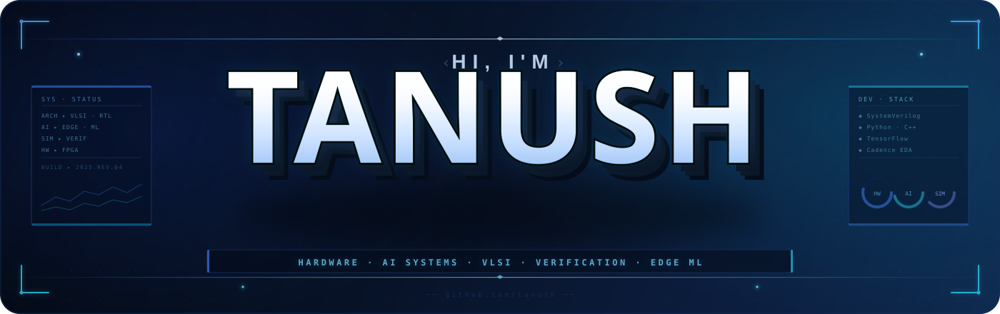
</p>

<p align="center">
  
</p>

<p align="center">
  <a href="https://github.com/HUNT-001">
    
  </a>
  &nbsp;
  <a href="https://www.linkedin.com/in/vakkalagadda-tanush-pavan-a37a20308/">
    
  </a>
  &nbsp;
  <a href="https://vtanushpavan.vercel.app/">
    
  </a>
  &nbsp;
  <a href="mailto:tanushpavanv@gmail.com">
    
  </a>
</p>

<p align="center">
  <b>Designing efficient intelligent systems across hardware, ML, embedded platforms, and deployable software.</b>
</p>

<p align="center">
  
  
</p>

<p align="center">
  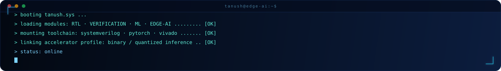
</p>

<!-- ═══════ ABOUT ═══════ -->
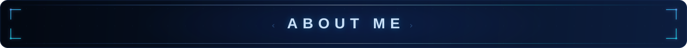

<p align="center">
I'm a dual-degree student building <b>efficient intelligent systems</b><br>
at the intersection of <b>AI, digital hardware, verification, and deployable software</b>.
</p>

<p align="center">
⚙️ AI accelerators • hardware-aware ML • RTL design • verification workflows
</p>

<p align="center">
🧠 Binary / quantized neural networks • embedded intelligence • scalable system engineering
</p>

<p align="center">
🚀 Research-driven ideas translated into practical engineering systems
</p>

<details>
<summary><b>View Profile Summary (Click to expand)</b></summary>

```python
class Engineer:
    def __init__(self):
        self.identity = {
            "name": "Tanush Pavan",
            "degrees": [
                "BS, Data Science — IIT Madras",
                "B.Tech, Electrical & Electronics Engineering — Amrita Vishwa Vidyapeetham"
            ],
            "domain": "AI accelerators, verification, and edge ML"
        }

        self.experience = [
            "AI Engineer Intern @ Wipro",
            "Edge AI Intern @ ADRIN (ISRO)"
        ]

        self.focus_areas = [
            "AI hardware and accelerator-oriented design",
            "RTL design, verification, and co-design workflows",
            "Efficient inference with binary / quantized neural networks",
            "Embedded and edge intelligence systems",
            "Applied ML for real-world engineering domains",
            "Tooling and automation for hardware development"
        ]

    def philosophy(self):
        return "Efficient, deployable, research-driven intelligent systems."
```

</details>

<p align="center">
  
</p>

<!-- ═══════ FOCUS AREAS ═══════ -->
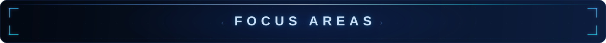

<p align="center">
🧩 AI hardware and accelerator-oriented design <br>
🔧 RTL design, verification, and co-design workflows <br>
⚡ Efficient inference with binary / quantized neural networks <br>
📡 Embedded and edge intelligence systems <br>
🩺 Applied ML for real-world engineering domains <br>
🛠️ Tooling and automation for hardware development
</p>

<p align="center">
  
</p>

<!-- ═══════ EXPERIENCE ═══════ -->
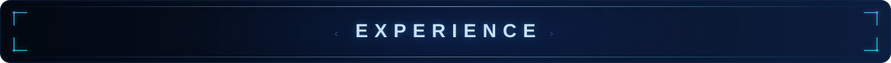

<table align="center">
<tr>
<td width="50%" valign="top">

### WIPRO
**`AI Engineer Intern | 2 Months`**
```yaml
Role: Applied AI/ML engineering
Focus:
  - Model development and evaluation workflows
  - Data pipelines and automation
  - Cross-functional delivery of AI-driven solutions
```

</td>
<td width="50%" valign="top">

### ADRIN (Advanced Data Processing Research Institute, NMRCE, ISRO)
**`Edge AI Intern | 45 Days`**
```yaml
Role: Edge intelligence for applied ML workflows
Focus:
  - On-device / edge deployment of ML models
  - Model optimization for resource-constrained hardware
  - Applied ML for real-world sensing and data pipelines
```

</td>
</tr>
</table>

<p align="center">
  
</p>

<!-- ═══════ CERTIFICATIONS ═══════ -->
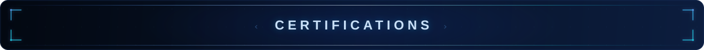

<div align="center">
  <table>
    <tr>
      <td align="center" width="20%">
        
        <br/><sub><b>Generative AI</b></sub>
      </td>
      <td align="center" width="20%">
        
        <br/><sub><b>Data Analytics</b></sub>
      </td>
      <td align="center" width="20%">
        
        <br/><sub><b>Microsoft Azure</b></sub>
      </td>
      <td align="center" width="20%">
        
        <br/><sub><b>Agentic AI Associate</b></sub>
      </td>
      <td align="center" width="20%">
        
        <br/><sub><b>Cloud Developer Engineer</b></sub>
      </td>
    </tr>
  </table>
</div>

<p align="center">
  
</p>

<!-- ═══════ TECH STACK ═══════ -->
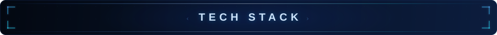

<p align="center">
  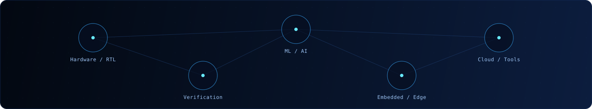
</p>

<h3 align="center">Hardware / Verification</h3>

<p align="center">
  
  
  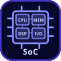
  
  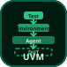
  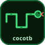
</p>

<h3 align="center">EDA / FPGA / Simulation</h3>

<p align="center">
  
  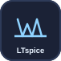
  
</p>

<h3 align="center">Programming</h3>

<p align="center">
  
  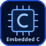
</p>

<h3 align="center">Machine Learning / AI</h3>

<p align="center">
  
  
  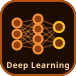
  
</p>

<h3 align="center">Data / Visualization</h3>

<p align="center">
  
  
</p>

<h3 align="center">Cloud / Version Control</h3>

<p align="center">
  
  
</p>

<p align="center">
  
</p>

<!-- ═══════ CURRENT FOCUS ═══════ -->
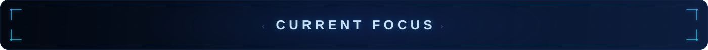

<p align="center">
  ⚙️ AI accelerator architectures and co-design workflows <br>
  🔍 Verification automation and modern tools <br>
  🧠 Binary / quantized neural networks for efficient inference <br>
  📡 Embedded intelligence for real-world deployment <br>
  🚀 Open-source engineering across AI and hardware systems
</p>

<p align="center">
  
</p>

<!-- ═══════ BACKGROUND ═══════ -->
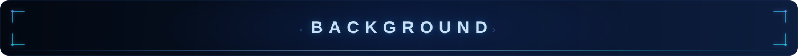

<p align="center">
  <b>BS in Data Science</b> — IIT Madras <br>
  <b>B.Tech in Electrical and Electronics Engineering</b> — Amrita Vishwa Vidyapeetham
</p>

<p align="center">
  
</p>

<!-- ═══════ GITHUB STATS ═══════ -->
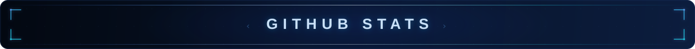

<p align="center">
  
  
</p>

<p align="center">
  
</p>

<p align="center">
  
  
  
</p>

<p align="center">
  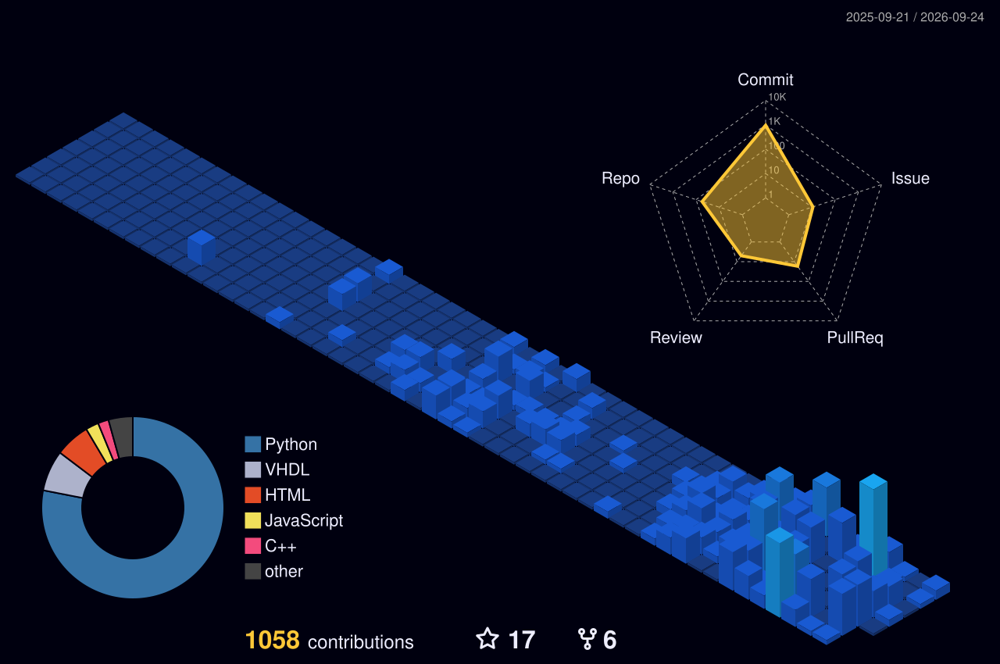
</p>

<p align="center">
  
</p>

<p align="center">
  
</p>

<!-- ═══════ CONNECT ═══════ -->
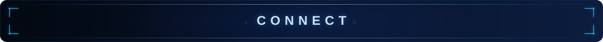

<p align="center">
  <a href="https://github.com/HUNT-001">
    
  </a>
  <a href="https://www.linkedin.com/in/vakkalagadda-tanush-pavan-a37a20308/">
    
  </a>
  <a href="https://vtanushpavan.vercel.app/">
    
  </a>
  <a href="mailto:tanushpavanv@gmail.com">
    
  </a>
</p>

<p align="center">
  <i>Building efficient, intelligent systems where hardware, software, and learning meet.</i>
</p>


