  

  <b>Developer-to-developer write-ups.</b> Case studies, project teardowns, technical deep-dives, and data stories — 
  the reasoning behind the work, not just the result.

  
  

---

## Index

> These markdown files are the single source of truth. The portfolio site reads
> the same files, so a write-up published here appears in both places.

### 🔬 Case studies

Real problems, the approach taken, what worked, what didn't, and the number that mattered.

| Title | One line | Status |
|:--|:--|:--|
| [MobileViTv2 on Versal VCK-190](case-studies/mobilevit-on-versal.md) | Fitting a vision transformer into an edge FPGA datapath | 🟡 draft |

### 🧩 Project write-ups

How a repo was built, the decisions underneath it, and what I'd change.

| Title | Repo | Status |
|:--|:--|:--|
| [Automating the cocotb v1 → v2 migration](project-write-ups/cocotb-v2-helper.md) | [`cocotb-v2-migration-helper`](https://github.com/HUNT-001/cocotb-v2-migration-helper) | 🟡 draft |

### ⚙️ Technical blogs

Focused deep-dives on one idea.

| Title | Topic | Status |
|:--|:--|:--|
| [Why hold violations survive simulation](technical-blogs/hold-violations.md) | Static timing, CTS | 🟡 draft |

### 📊 Data stories

A dataset, a question, and what the numbers actually say.

| Title | Dataset | Status |
|:--|:--|:--|
| _(nothing published yet)_ | — | — |

---

## Writing a new post

1. Copy [`_TEMPLATE.md`](_TEMPLATE.md) into the right folder (`case-studies/`, `project-write-ups/`, `technical-blogs/`, or `data-stories/`).
2. Fill in the frontmatter block at the top — `title`, `date`, `tags`, `summary`. The portfolio reads these.
3. Add a row to the index table above.
4. Commit. That's the whole pipeline.

  

